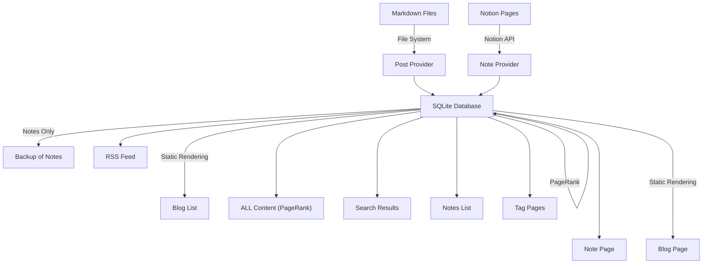

## JordanEldredge.com

My personal website. Currently built with Next.js.

For posts about the development of this site, see posts with the [#thisSite](https://jordaneldredge.com/tag/thisSite/) tag.

## Architecture

This site features two types of content. Blog posts, which are written as Markdown files with header metadata and committed into the GitHub repository, and Notes which are written in [Notion](https://www.notion.so/) and fetched via the Notion API.

Both types of content are normalized into a single format of Markdown files stored in an SQLite database. SQLite acts as a cache for pages fetched from Notion, but also allows us to store additional metadata about each page in a structured manner such as full text search, related posts, and a ranked `/all` page using a simple PageRank algorithm.

### Providers

Blog posts and Notes are implemented as two separate providers. Each provider is responsible for fetching content from its respective source, normalizing it into a common format which can be written to the SQLite database. This interface allows reindexing to ask the provider to enumerate all of its pages as well as the time at which it was last modified. Actually fetching/reading the content is done lazily, only if the content has changed since it was last indexed.

### Tags

Each post has zero or more tags. For Notion notes these are attributes of the page. For blog posts these are specified in the front matter. Tags are used to compute related posts and to generate tag pages. They also help with the flow of page rank by enriching the page graph. Finally, they allow users to view posts by tag. e.g. [/tag/thisSite](https://jordaneldredge.com/tag/thisSite/).

### Related Posts

Each post is rendered with a small section at the end which links to "related" posts. Related posts are computed by finding the `n` posts with the most tag overlap to the current post. If multiple posts have the same overlap, the post's PageRank is used to break the tie.

### Search

We leverage SQLite's FTS (full text search) feature to provide search functionality. This is implemented via a virtual FTS table with triggers on the main content table to keep it up to date.

### Updating SQLite

Each row in the SQLite database includes a `last_updated` field. Combined with file system timestamps for blog posts, and `last_edited_time` for Notion pages, we can determine if a page has been updated since the last time we fetched it. This allows us to cheaply test if a page needs to be reindexed, or if it can be skipped.

Reindexing can be triggered in one of two ways. By visiting the `/api/reindex` endpoint, or by running the `pnpm run reindex` script.

### Page Rank

I've been curious about [PageRank](https://en.wikipedia.org/wiki/PageRank) for a while, and in an attempt to understand it better. This overlapped with an observation that likely most people don't visit my site expecting to "catch up" on my recent posts. Likely most visitors are just passing by and are interested in learning about me. To that end, a chronological list of posts is not the most useful thing to show them. Instead, I thought to derive a page of posts ranked by their relevance. To try to derive this relevance order I've implemented a simple PageRank algorithm. Currently it uses links within page's contents, tags, as well as a small, manually curated collection of links _from_ notable external sites. The result is the (currently unlisted) `/all` page.

### Backups

While Notion is very convenient for writing and editing content, I wanted an editor agnostic backup of my content. I liked how the "markdown file in a git repo" model provided a format that was easy to replicate to multiple locations (GitHub, a server, my laptop), was easy to inspect, and also provided an auditable (and revertible) history. To provide those same benefits for Notion content, I've implemented a backup system that fetches all Notion pages and stores them in a git repository. This is done via the `pnpm run backup` script.

### RSS

I've implemented an RSS feed for the blog posts. This is generated by querying the SQLite database and rendering them as an XML/JSON feed.

### Diagram

